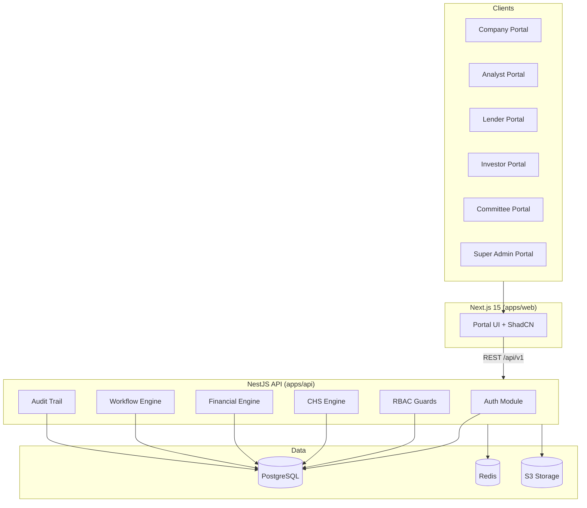

# CapitalOS — System Architecture

## Overview

CapitalOS is a Capital Intelligence Operating System that connects borrowers, advisors, lenders, investors, and credit committees through a unified CHS (Capital Health Score) intelligence layer.

## Technology Stack

| Layer | Technology |
|-------|------------|
| Frontend | Next.js 15, TypeScript, Tailwind CSS, ShadCN UI |
| Backend | NestJS, TypeScript |
| Database | MySQL (Hostinger) |
| ORM | Prisma 6 |
| Cache | Redis 7 |
| Storage | S3-compatible (MinIO) |
| Auth | JWT + Refresh Tokens + TOTP MFA |
| Authorization | RBAC with permission guards |
| API Docs | OpenAPI / Swagger |
| Monorepo | pnpm workspaces + Turborepo |

## High-Level Architecture



## Module Map

| Module | Phase | Status |
|--------|-------|--------|
| Authentication | 1 | Implemented |
| Authorization (RBAC) | 1 | Implemented |
| Master Data | 1 | Implemented |
| Industry Taxonomy | 1 | Implemented |
| Company Management | 1 | Implemented |
| Audit Trail | 1 | Implemented |
| Document Vault | 2 | Schema ready |
| Client Data Sheet | 2 | Schema ready |
| Financial Engine | 2 | Schema ready |
| CHS Engine | 3 | Schema ready |
| Risk Matrix | 3 | Schema ready |
| AI Recommendations | 3 | Schema ready |
| Workflow | 4 | Schema ready |
| Committee | 4 | Schema ready |
| Reporting | 4 | Schema ready |
| Debt Rail | 5 | Schema ready |
| Equity Rail | 5 | Schema ready |
| Startup Rail | 5 | Schema ready |

## Core Design Principles

1. **Explainable scoring** — Every CHS parameter has evidence, scoring mode, and audit trail
2. **No black-box** — AI suggestions are advisory; analysts control final scores
3. **Override governance** — Overrides require reason, evidence, user, and timestamp
4. **Industry-specific** — Pillar weights, KPIs, and parameters vary by industry/sub-sector
5. **Multi-tenant** — Organizations scope users, companies, and data
6. **Audit everything** — Full event logging for regulatory compliance

## Security Architecture

- JWT access tokens (15m default) + refresh tokens (7d)
- TOTP MFA via otplib
- RBAC with granular permissions per module
- Helmet security headers
- Rate limiting via @nestjs/throttler
- Input validation via class-validator
- Password hashing with bcrypt (cost 12)

## Deployment Topology

```
┌─────────────┐     ┌─────────────┐     ┌─────────────┐
│   Next.js   │────▶│   NestJS    │────▶│ PostgreSQL  │
│   :3000     │     │   :3001     │     │   :5432     │
└─────────────┘     └──────┬──────┘     └─────────────┘
                           │
                    ┌──────┴──────┐
                    │             │
               ┌────▼───┐   ┌─────▼────┐
               │ Redis  │   │  MinIO   │
               │ :6379  │   │  :9000   │
               └────────┘   └──────────┘
```
