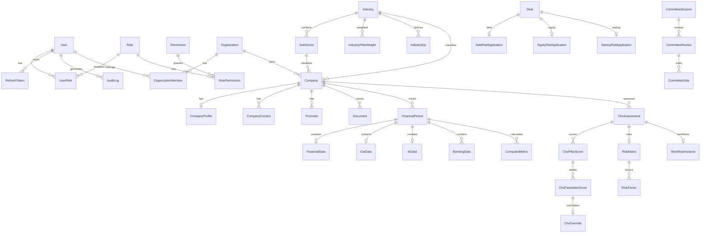
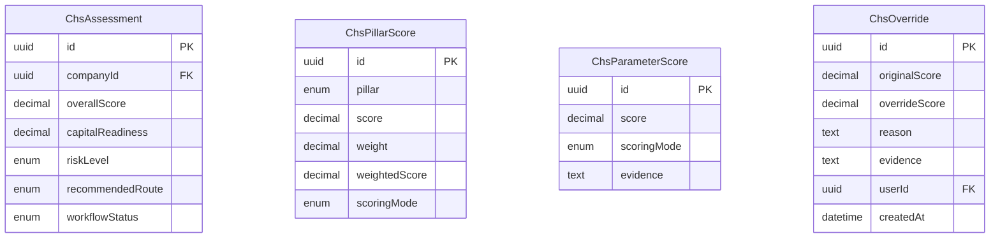
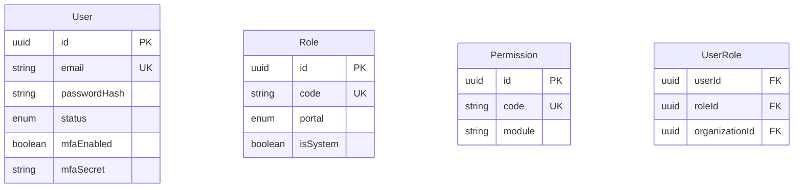

# CapitalOS — Entity Relationship Diagram

## Core Domain ER Diagram

```mermaid
erDiagram
    User ||--o{ UserRole : has
    Role ||--o{ UserRole : assigned
    Role ||--o{ RolePermission : has
    Permission ||--o{ RolePermission : granted
    User ||--o{ RefreshToken : owns
    User ||--o{ AuditLog : generates

    Organization ||--o{ OrganizationMember : has
    User ||--o{ OrganizationMember : belongs
    Organization ||--o{ Company : owns

    Industry ||--o{ SubSector : contains
    Industry ||--o{ IndustryPillarWeight : weighted
    Industry ||--o{ IndustryKpi : defines
    Industry ||--o{ Company : classifies
    SubSector ||--o{ Company : classifies

    Company ||--o| CompanyProfile : has
    Company ||--o{ CompanyContact : has
    Company ||--o{ Promoter : has
    Company ||--o{ Document : stores
    Company ||--o{ FinancialPeriod : tracks
    Company ||--o{ ChsAssessment : assessed

    FinancialPeriod ||--o| FinancialData : contains
    FinancialPeriod ||--o| GstData : contains
    FinancialPeriod ||--o| ItrData : contains
    FinancialPeriod ||--o{ BankingData : contains
    FinancialPeriod ||--o{ ComputedMetric : calculates

    ChsAssessment ||--o{ ChsPillarScore : scores
    ChsPillarScore ||--o{ ChsParameterScore : details
    ChsParameterScore ||--o| ChsOverride : overridden
    ChsAssessment ||--o| RiskMatrix : risks
    RiskMatrix ||--o{ RiskFactor : factors
    ChsAssessment ||--o| WorkflowInstance : workflows

    Deal ||--o| DebtRailApplication : debt
    Deal ||--o| EquityRailApplication : equity
    Deal ||--o| StartupRailApplication : startup

    CommitteeSession ||--o{ CommitteeReview : reviews
    CommitteeReview ||--o{ CommitteeVote : votes
```

## CHS Scoring Model

```mermaid
erDiagram
    ChsAssessment {
        uuid id PK
        uuid companyId FK
        decimal overallScore
        decimal capitalReadiness
        enum riskLevel
        enum recommendedRoute
        enum workflowStatus
    }

    ChsPillarScore {
        uuid id PK
        enum pillar
        decimal score
        decimal weight
        decimal weightedScore
        enum scoringMode
    }

    ChsParameterScore {
        uuid id PK
        decimal score
        enum scoringMode
        text evidence
    }

    ChsOverride {
        uuid id PK
        decimal originalScore
        decimal overrideScore
        text reason
        text evidence
        uuid userId FK
        datetime createdAt
    }
```

## Authentication & Authorization

```mermaid
erDiagram
    User {
        uuid id PK
        string email UK
        string passwordHash
        enum status
        boolean mfaEnabled
        string mfaSecret
    }

    Role {
        uuid id PK
        string code UK
        enum portal
        boolean isSystem
    }

    Permission {
        uuid id PK
        string code UK
        string module
    }

    UserRole {
        uuid userId FK
        uuid roleId FK
        uuid organizationId FK
    }
```
